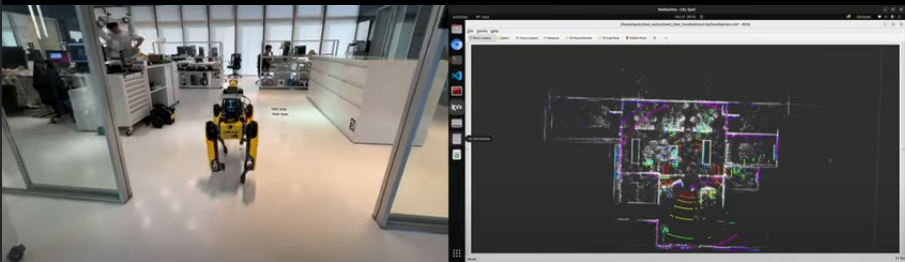

# Spor_Switch_Map_System

## Overview
This work presents an advanced inspection system utilizing Boston Dynamics' Spot for autonomous industrial monitoring in collaboration with TSMC. The system integrates Routing System, Multi-Map navigation, and digital twin simulation through NVIDIA Isaac Sim to enhance operational efficiency in large-scale environments. By combining these technologies, we establish a scalable, memory-efficient, and highly reliable framework for autonomous industrial inspection.


## **Map Switching System**
- Optimizes memory usage by eliminating the need to load an entire large-scale map

- Enhances scalability, enabling efficient expansion of mapped areas

- Ensures precise localization, with AprilTags setting Spot’s initial pose after each transition

By partitioning large spaces into manageable sub-maps and leveraging AprilTag-assisted positioning, we enable reliable and efficient navigation throughout extensive factory environments.

## **Demo**

### **City Science Lab Test Demo**
[](https://youtu.be/ZL_bb400D3o?si=JQu_fL6QrJcjI_Wx)

- Showcases system performance in controlled laboratory conditions.
- Demonstrates precise navigation and mapping capabilities.
- Validates map switching functionality in indoor environments.

### **Outdoor Test Demo**
[](https://youtu.be/LI97OdDDBUY?si=Lni16U4oqysuG10Y)

- Illustrates system robustness in challenging outdoor conditions.
- Demonstrates real-world application scenarios.
- Validates system performance across varied terrain and lighting conditions.

## **Launch Instructions**

### **Start the System**
Open the following terminals and execute the respective commands:

#### **Terminal 1**
```sh
cd spot_demo/
sh start_demo.sh
```

#### **Terminal 2**
```sh
cd routing_engine_ws/
ros2 launch routing_agent RunServer.launch.py
```

#### **Terminal 3**
```sh
ssh Spot 
cd spot_map_switching_ws/
ros2 run spot_graph_nav spot_graph_nav_node 192.168.50.3
```

#### **Terminal 4**
```sh
cd spot_map_switching_ws/
ros2 run switch_pcd_map switch_pcd_map_node
```

#### **Terminal 5**
```sh
cd spot_map_switching_ws/
ros2 run map_manager map_manager_node
```

### **Visualizing the Graph**

#### **Terminal 1**
```sh
cd spot_map_switching_ws/
ros2 run switch_pcd_map switch_pcd_map_node
```

#### **Terminal 2**
```sh
cd spot_map_switching_ws/
ros2 service call /switch_map switch_map_interfaces/srv/SingleMap "mapid: 0"
```

#### **Terminal 3**
```sh
cd routing_engine_ws/src/routing_engine/graph_collector_and_visualization
python3 graph_visualizer.py
```

**Note:** Modify line 30 in `graph_visualizer.py` to match the corresponding waypoint file path.

