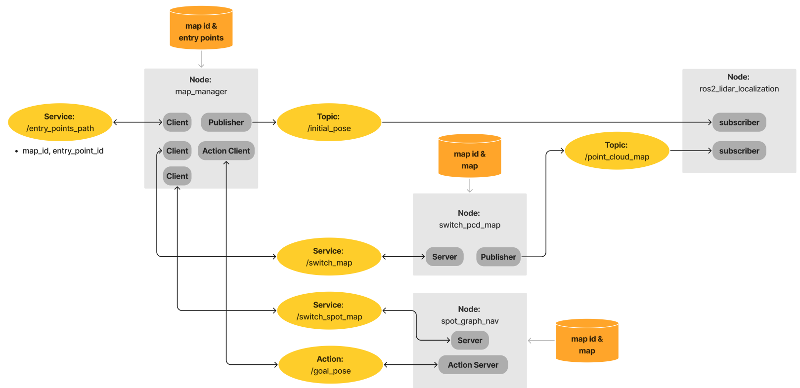

# Spor_Switch_Map_System

An industrial inspection system was developed using Boston Dynamics' Spot. Implementing SLAM and Navigation via Spot SDK on ROS2, it features remote monitoring through a visualization interface. A Spot simulation in Isaac Sim validates algorithms and creates a Digital Twin.

## **Framework**

### Map Manager
- Responsible for determining when to switch between maps and sending goal poses to the robot.
### Spot Graph Nav
- Enables autonomous navigation by allowing Spot to navigate to target locations based on user-defined waypoints.
### Switch PCD Map
- Handles map publishing to the localization system and determines the robot's initial position by detecting nearby AprilTags.

## **Demo**
