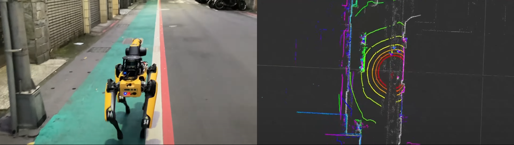

# Spor_Switch_Map_System

This project focuses on implementing Boston Dynamics' Spot robot for automated inspection tasks in industrial environments. Under strict cybersecurity regulations, we have developed an advanced automated site inspection and remote monitoring system. This system aims to enhance automation levels and monitoring efficiency in industrial environments, bringing significant operational benefits and competitive advantages to enterprises.

## **Framework**

### Map Manager
- Responsible for determining when to switch between maps and sending goal poses to the robot.
### Spot Graph Nav
- Enables autonomous navigation by allowing Spot to navigate to target locations based on user-defined waypoints.
### Switch PCD Map
- Handles map publishing to the localization system and determines the robot's initial position by detecting nearby AprilTags.

## **Demo**
### City Science Lab Test Demo

- Showcases system performance in controlled laboratory conditions
- Demonstrates precise navigation and mapping capabilities
- Validates map switching functionality in indoor environments

### Outdoor Test Demo

- Illustrates system robustness in challenging outdoor conditions
- Demonstrates real-world application scenarios
- Validates system performance across varied terrain and lighting conditions
